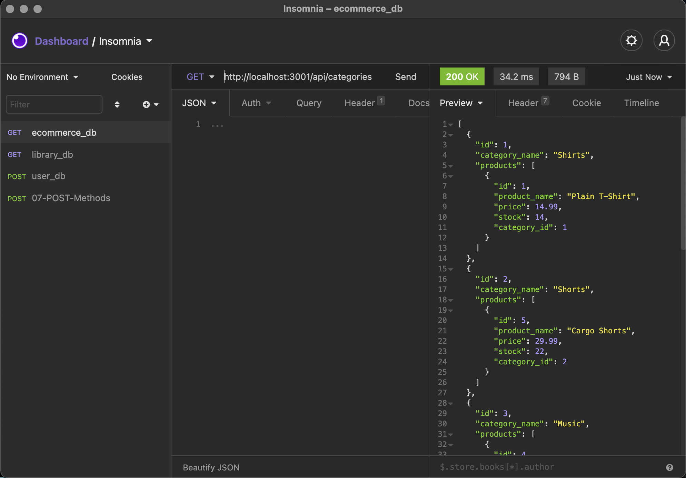
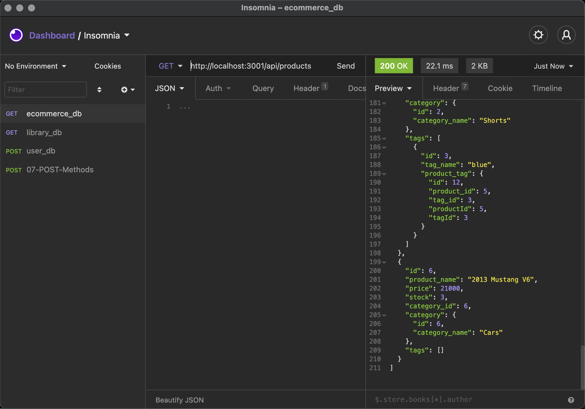
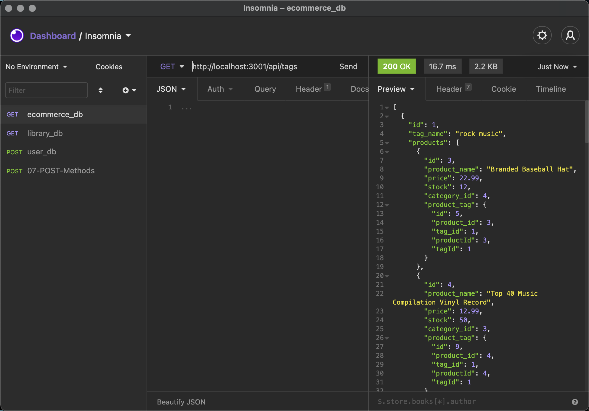
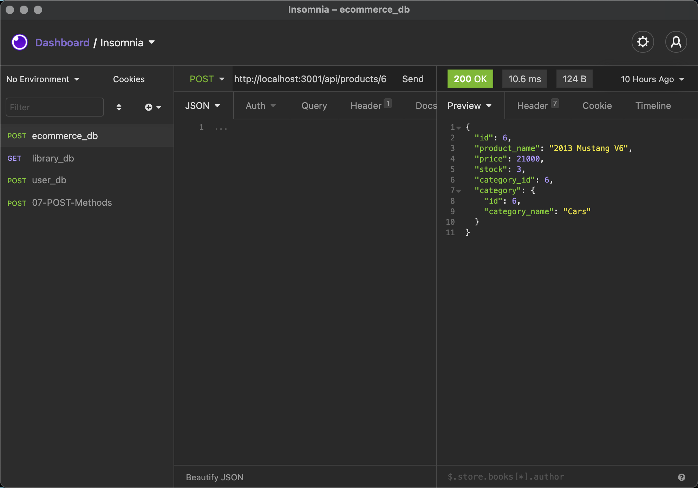

# Back-End E-Commerce Application

## Table of Contents

* Description
* Installation
* Usage
* Contributions
* Licensing
* Tests
* Demo
* Questions

## Description

Using a MySQL schema database and seeded information, this application can be ran through your Terminal and navigated through Insomnia Core using GET, POST, PUT and DELETE requests.

## Installation

The project can be installed by cloning the HTTPS repository git address to a localized repository.

## Usage

The focus of this application is to utilize Insomnia Core in order to test the designated routes related to issued products, the categories they fall and, and numerical tagging of the items, as well as POSTING and DELETING categories and products respectively when so desired.

## Contributions

There are no other contributors to this project.

## Licensing

## Tests

Users test the application by entering the desired route in the browser entry of Insomnia Core. Working routes will return a 200 Status, and the associated information of the route will be displayed in Preview. Also, POST and DELETE request functions work appropriately to add or remove product information to the database.

## Demo

Here are screenshots of working Insomnia Core routes:

Here is an example of a working POST request product having been added to the database:

For a recorded demonstration of the working application, follow the link:

## Questions

* You can follow my repositories at https://www.github.com/jarretebarnett
* For professional inquiries, you can email jarretebarnett@gmail.com